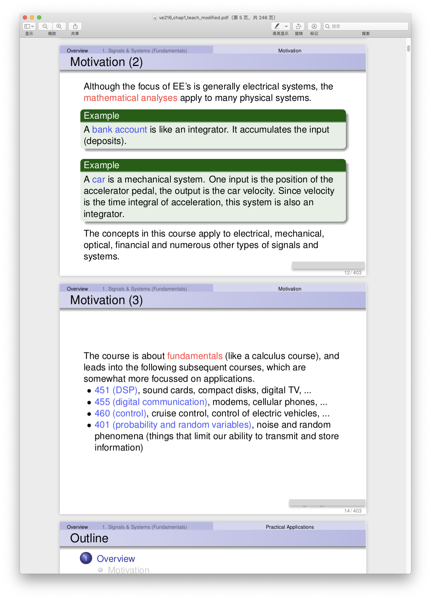

# pdfDropDuplicate

Ever downloaded a lecture slide like this?


The duplicates are used for presentation, but they become annoying when one wants to read the PDF slides. This simple tool automatically drops the duplicates in the PDF files, for a better readability. 

Please clone the repo using:

```
$ git clone https://github.com/Enoch2090/pdfDropDuplicates.git pdfDropDuplicate
$ cd pdfDropDuplicate
```

## Dependency

Use the following command to install all Python dependencies:

```shell 
$ pip3 install -r requirements.txt
```

## Usage

Use command line to interact:

```shell
$ python3 pdfDropDuplicates.py --dir ve216,chap1,teach.pdf
```

In this case, it will generate `ve216,chap1,teach_modified.pdf` in the same directory.
  


If you are providing a PDF file to the tool, the path to file can be either relative or absolute path. Therefore the following command has the same effect:

```shell
$ python3 pdfDropDuplicates.py --dir Users/enoch/ve216slides/ve216,chap1,teach.pdf
```

However if you are providing a directory to the tool, the path to the directory **must be an absolute path**. For instance:

```shell
$ python3 pdfDropDuplicates.py --dir Users/enoch/ve216slides
```

This will traverse all PDF files under the directory, and generate duplicate-dropped versions in the same directory as the original PDF file.

## Features
- [X] Generate PDF files that without duplicates.
- [X] Traverse a given directory to perform drop tasks.
- [X] Preserve the TOC structure in the original PDF file.
- [ ] Modify the page number at the same time.
- [ ] Log printer.
- [ ] More custom configurations.

## Update Logs:
- 2020/5/19: Now pdfDropDuplicates will preserve the original TOC structure.
- 2020/5/18: Code Refactored. Uses PyMuPDF now instead of PyPDF2 and pdf2image, and also rewrited some part to remove OpenCV dependency.
- 2020/5/17: Project INIT.

## Licence
[GNU GPL v3.0](https://www.gnu.org/licenses/gpl-3.0.html)
## Contacts
Visit: 
- [My Blog](https://enoch2090.me)  
- [WhiteGivers](https://whitegivers.com)